<h2>Mapping Objet Relationnel (ORM), JPA, Hibernate, Spring Data</h2>

<h3>L'ensemble des Entités JPA :</h3>
<h4>L'Entité Patient : </h4>
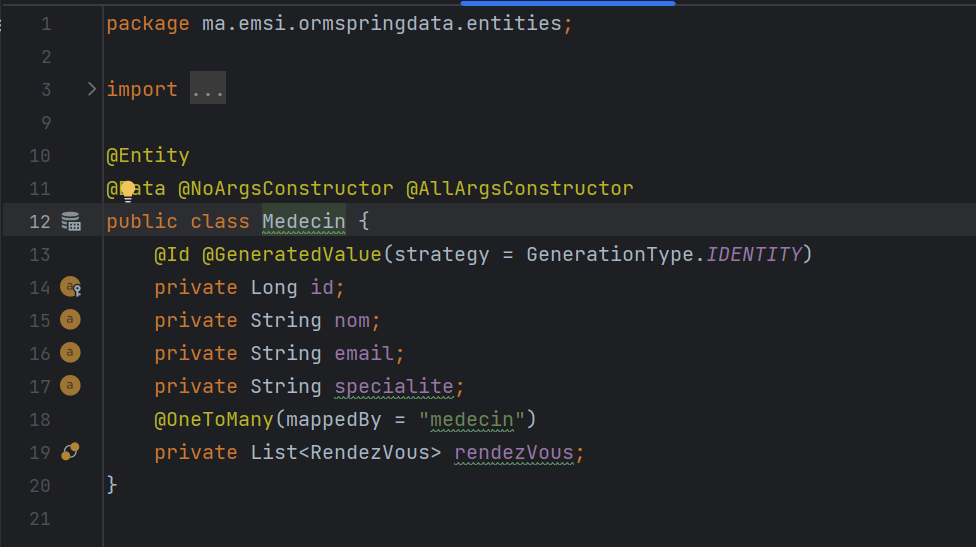

<h4>L'Entité Medecin : </h4>

<h4>L'Entité RendezVous : </h4>

<h4>L'Entité Consultation : </h4>

<h4>L'Entité User : </h4>

<h4>L'Entité Role : </h4>

<h3>L'ensemble des Repositories :</h3>
<h4>PatientRepository : </h4>
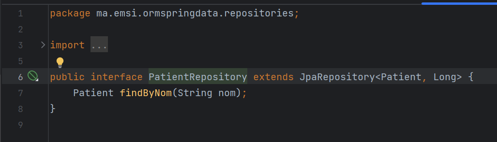

<h4>MedecinRepository : </h4>
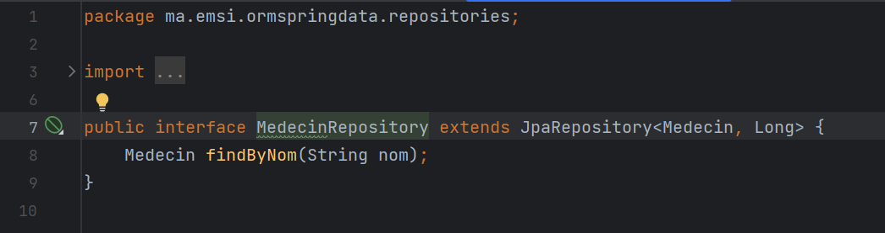

<h4>RendezVousRepository : </h4>
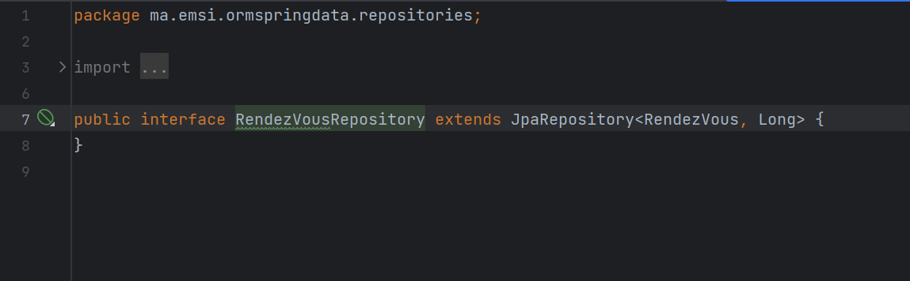

<h4>ConsultationRepository : </h4>
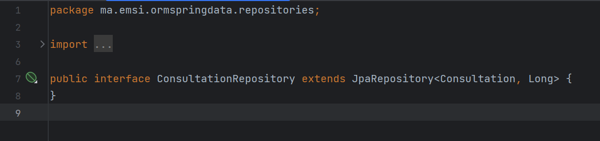

<h4>UserRepository : </h4>
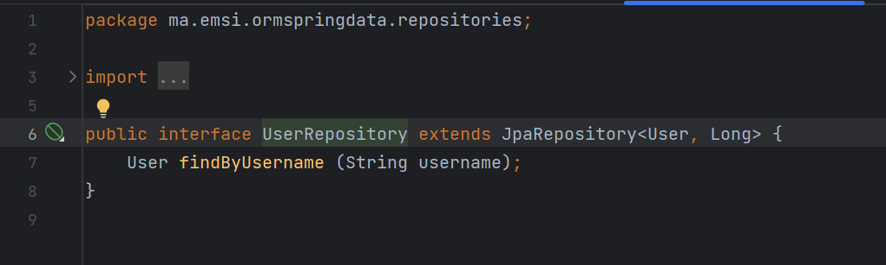

<h4>RoleRepository : </h4>
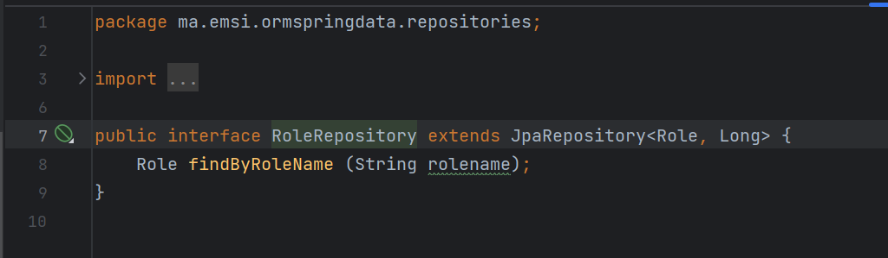

<h3>La Couche Service :</h3>
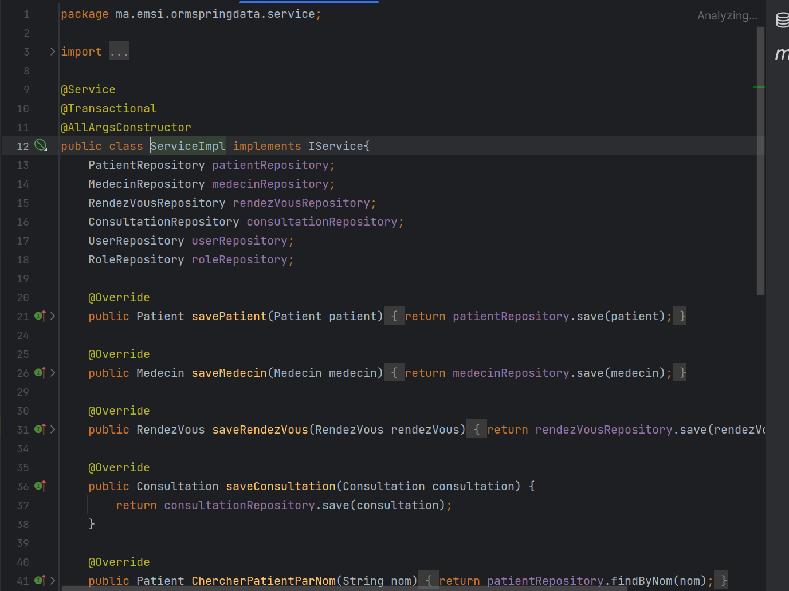
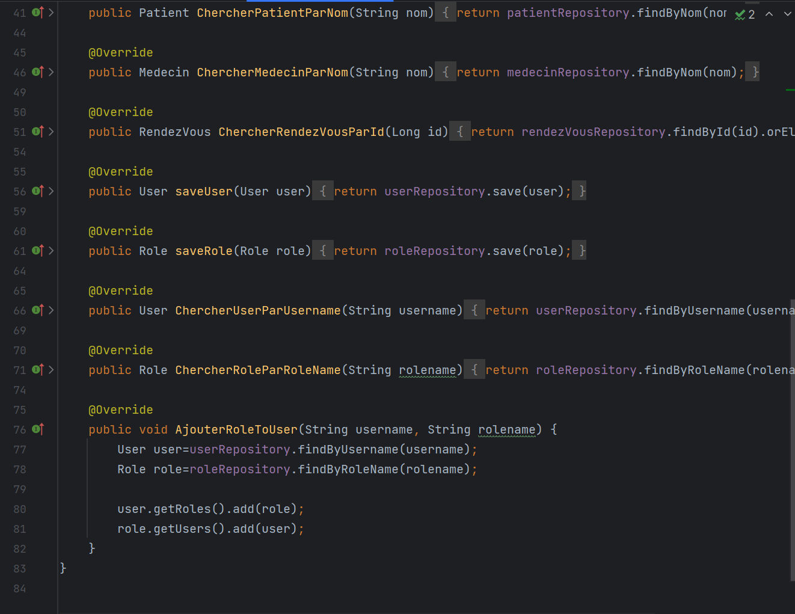

<h4>L'interface IService :</h4>
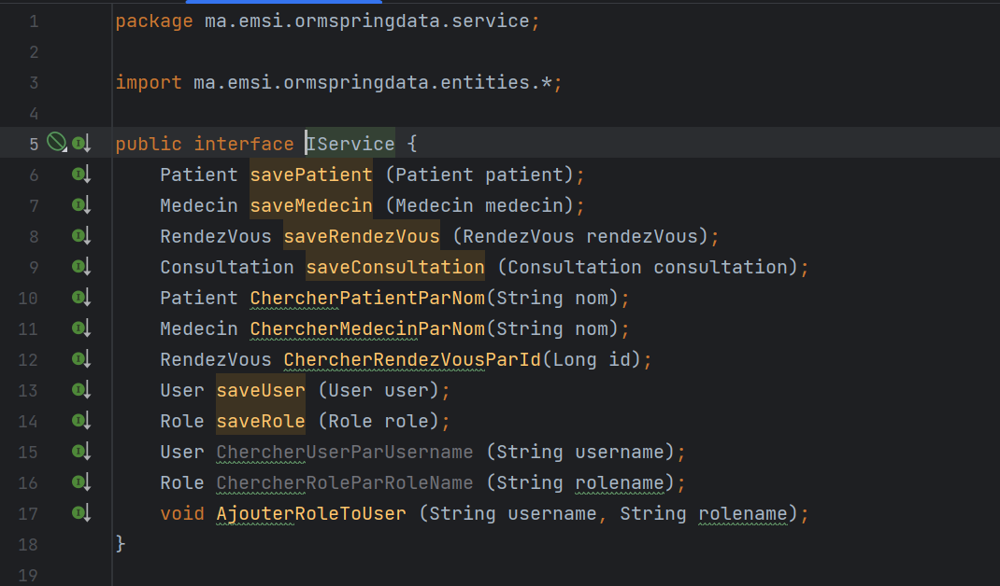
    
<h4>Test de l'application :</h4>
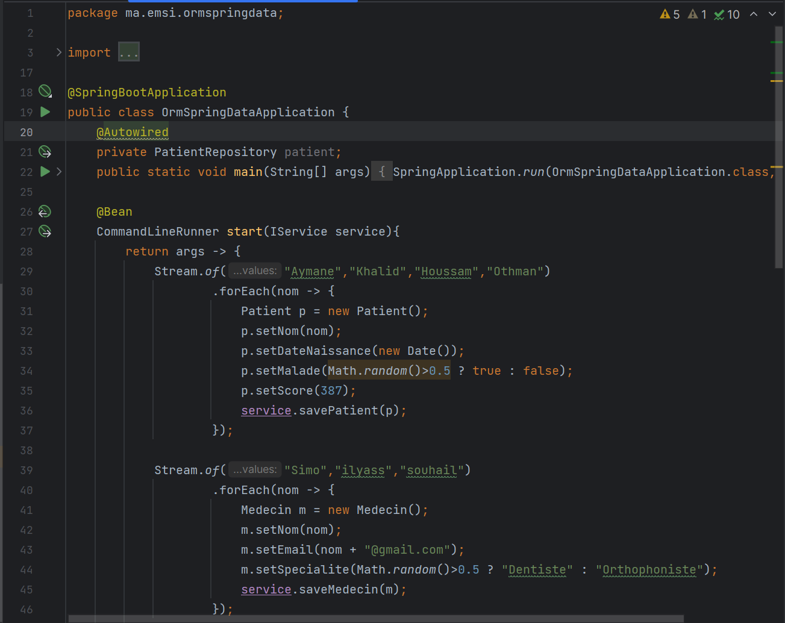
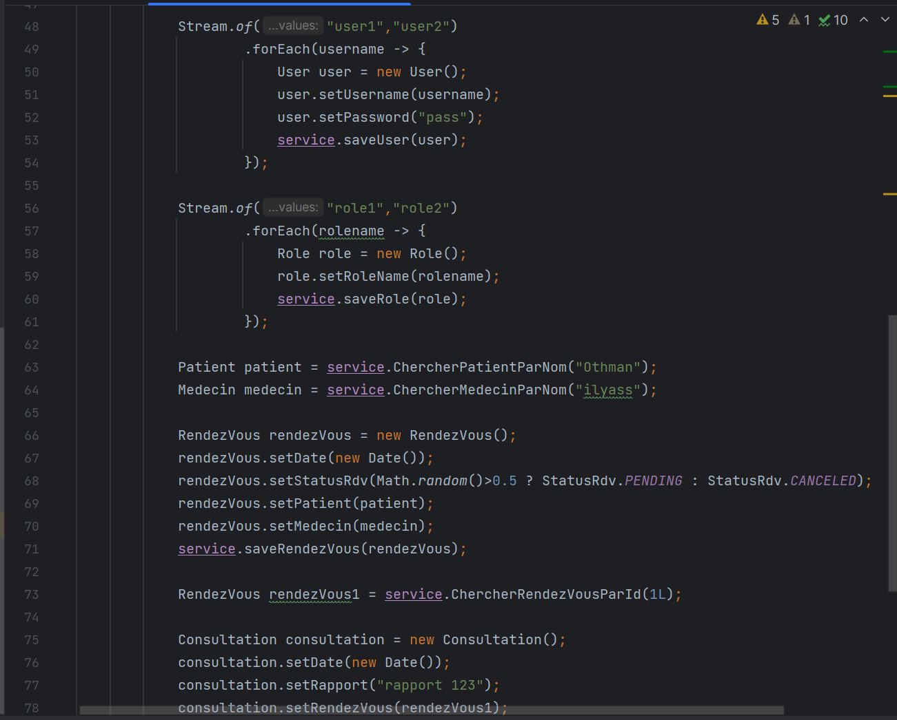
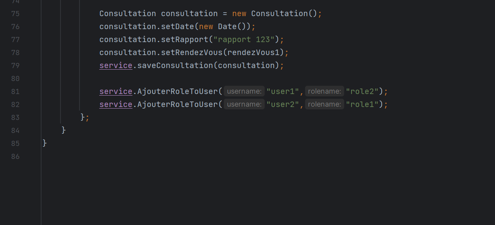
